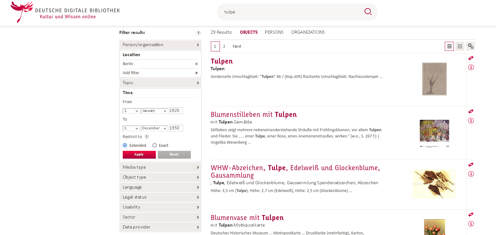

# Hilfsmittel zur DDB-Api

Die Datei `ddbAPI_helpers.py` enthält einige Funktionen, die die Arbeit mit der DDB und der DDB-API erleichtern sollen.

## Konvertierung einer Suchanfrage in einen API-Call

`search2API(queryurl, api_key)` konvertiert die URL einer DDB-Suchanfrage in einen API-Aufruf.

Benötigt wird ein API-Key, den man nach Registrierung auf der DDB erhält (näheres [hier](https://labs.deutsche-digitale-bibliothek.de/app/ddbapi/)).

## Iterativer Download

Die API gibt je Aufruf eine bestimmte Teilmenge der gesamten Treffermenge zurück.
Für einen Komplettabzug der Treffermenge bedarf es einer iterativen Abfrage.

Dies leistet die Funktion `iterateAPICall`.

Die Funktion verlangt eine API-URL (generiert z.B. mit per `search2API`) und einen `api_key`.
Es besteht durch `download = True` die Möglichkeit, die Daten herunterzuladen.
Sofern für `targetdir` kein Wert festgelegt wird, erfolgt der Download ins das aktuelle Verzeichnis.
Wird über `targetdir` ein Wert übergeben, wird nötigenfalls ein entsprechender Ordner angelegt und die Dateien dorthin gespeichert.
`sourcexml` ist standardmäßig `True`, d.h. es wird der Quelldatensatz heruntergeladen, nicht der DDB-JSON-Wrapper (letzteres kann durch `sourcexml = False` erreicht werden).

### Anwendungsbeispiel

Mit folgendem Code lassen sich die Metadaten-XML-Files zur Suchanfrage "tulpe" mit Filtereinschränkung auf den Ort Berlin und die Zeit von 1920 bis 1950 herunterladen.

{ width = 50% }

Es wird dafür eine Ordner `tulpe_berlin` erzeugt.

```python
from ddbAPI_helpers import search2API, iterateAPICall

api_key = "<MY API KEY>"

search_url = "https://www.deutsche-digitale-bibliothek.de/searchresults?isThumbnailFiltered=true&query=tulpe&offset=0&facetValues%5B%5D=place_fct%3DBerlin&facetValues%5B%5D=begin_time%3D%5B*%20TO%20712193%5D&facetValues%5B%5D=end_time%3D%5B700901%20TO%20*%5D"
 
api_url = search2API(search_url, api_key)

iterateAPICall(api_url, api_key, download = True, sourcexml = True, targetdir = "tulpe_berlin")
```

## Verschiedenes

`datasetFromObject(object_ID:str, api_key)` gibt die die Api-Aufruf mit dataset-Id zu einer Objekt-ID zurück.
Die resultierende URL kann der Funktion `iterateAPICall` übergeben werden.
Auf diese Weise lässt sich zu einem bestimmten Objekt der gesamte übergeordnete Datensatz herunterladen.


